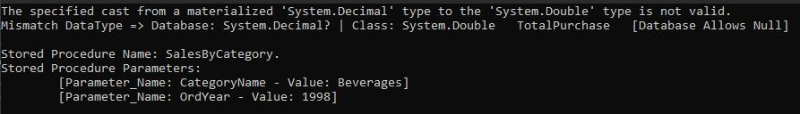
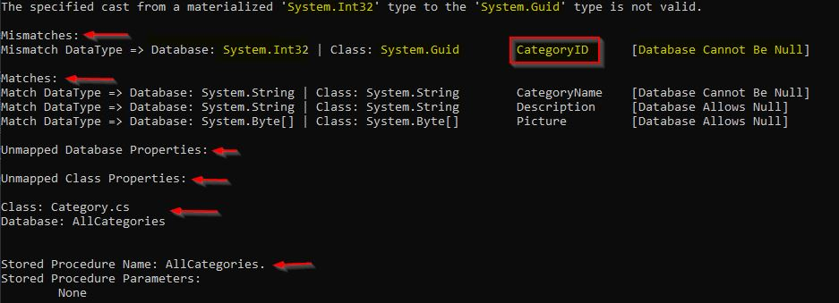

# EntityFramework.BasicObjectRelationalMapper
**Library to map stored procedures to a C# class using Entity Framework and reverse engineer to a POCO class.**

***
By: Marcos
## Purpose
This libary was built out of necessity where I frequently worked with stored procedures and needed a way to get their datatypes and to debug to during development.

It was also a little cumbersome to use the EDMX tools in Visual Studio to reverse engineer stored procedures, and sometimes it would not work properly if the stored procedure used #temp tables or peformed and UPDATE of any kind as it could not get the metadata needed to generate the class.

I just need to something simple to create a C# class or debug if the datatypes didn't match between the Stored Procedure and C# class.

This intent of this library is to:
* Automatically map the result set from a stored procedure to the corresponding C# class
* Need to debug or diagnose mismatched datatypes during development. (The schema and datatypes can change affecting your model.) 


## **Disclaimer**

* This tool is provided on an"as-is" basis if you need to quickly debug and compare the data type between the database (SqlDataReader) and the respective C# class. 
* Please consider using supported and tested ORM tools such as EntityFramework, Dapper, NHibernate, or ReversePocoGenerator.

***
## Table of Contents

* Purpose/**Disclaimer**
* What this library does
* Setup - Adding the library to your project
* Getting Started (1) - Using the libary as a Diagnostic Tool
* Getting Started (2) - Using the libary to generate a POCO Class
* Getting Started (3) - Using the libary as an ORM
* Tips on Stored Procedures for MS SQL Server

***


## What this library does
This library does 3 main things.

1. First, It can be used as a diagnostic tool; It can compare the data types properties (columns) between a SqlDataReader and the corresponding C# class.
2. Second It can be used to help create a POCO class
3. Third, it can be used as an ORM (Object Relational Mapper)

***
## **Setup - Adding the library to your project**

This project is a class library built on .Net Framework 4.7.2.
It also has a dependency on EntityFrameWork 6.4.4 by Mircosoft

If you are using Visual Studio, then

1. You can include this project into your solution, OR
2. Build this project to create the "BasicObjectRelationalMapper.dll" file, and manually add the Reference into your project. 

* This library does not have a nuget package. 
* This libary will not be ported to .NET 5 (Net Core)

***

## **Getting Started (1) - Using the libary as a Diagnostic Tool**

### **Example of use by the ORM part of this library**

This library uses `Reflection` and `SqlDataReader` to grab the data types from both the C# class and the SqlDataReader and compares them to find all the properties that Mismatch, Match, or unused from the Class or SqlDataReader.

    ALERT: Be Aware that Reflection is costly on memory and slow, and should be used sparingly. 

* When using this libray as an ORM, in particular the the `MapToModel<T>()` methods, you can expect an exception message similar to the image below when mapping a stored procedure to the C# class where the data type don't match. 

* You can quickly determine the names of the property and datatype that are not matching.

* In this case, the property "TotalPurchase" has the equivalent of the data type of `decimal?` coming from the stored procedure, but it is being mapped to a datatype of `double` in the C# class, hence the reason the exception is thrown. 

* Additionally, "TotalPurchase" has  **[Database Allows Null]**, meaning value for this property can be null.

* The exception message even shows the Name of Stored Procedure and the values used in the parameters.



Full Output Result - The image below shows the full output log.

In this example, there is a mismatch for the "CategoryID", and it also show the other properties that are ok (match).




### **Using the library as a Diagnostic Tool**
For the diagnostic tool import the following in the class where calls to the database are made. 
```
using BasicObjectRelationalMapper.Diagnostics;
```
1. To get the comparison result call a new instance of the `PropertyValidator` and pass the necessary parameters in the constructor which are: The C# class, SqlDataReader, and the dataReaderName (Stored Procedure or Sql Query)

2. Call the `Validate()` method to get the `ComparisonResult` object.

3. You can run the `PrintOutFullResults()` method to get a print out of all the results or choose to run other methods.

    The other methods are : `MismatchedResults()`, `MatchedResults()`, `GetUnmappedDatabaseProperties()`, and `GetUnmappedClassProperties()`

Example of use:

```
// ...omitted code here
catch(Exception ex)
{
    //Note: T is the Type of class. 

    var validator = new PropertyValidator( typeof(T), sqlDataReader, storedProcedureName );
    var result = validator.Validate();
    var fullResultPrintOut = result.PrintFullResults(); //returns List<string>

    string logResult = string.Join("\n", fullResultPrintOut); //flattens the result to a string with indents;

    _logger.Log(logResult); //Logs message. Assume there is a logger. 
    throw;
}

```


***
## **Getting Started (2) - Using the libary to generate a POCO Class**

The ability to generate a POCO (Plain Old C# Object) is limited. It will not write the .cs file. However, it will generate a string that contains all the lines for a POCO file (except the namespace), and that is ready to be written to a file. 

You will need to import:
```
BasicObjectRelationalMapper.Modeling
```
1. Call the `ModelGenerator` class and pass the connection string. 
2. Create `StoredProcedureInfo` object for a stored procedure. 

    Include the stored procedure name, sql parameters, and the class name.
3. Pass the `StoredProcedureInfo` object to the method `GetPocoDataclass()` in `ModelGenerator`
4. The result is a `PocoDataClass`
5. Call the method `GeneratePocoClass()` from the `PocoDataClass` to get the `string` which has data the represents the POCO class.

    * **Note:** The `ModelGeneratorClass` has a `GetPocoDataClasses()` method that take an `IEnumerable<StoredProcedureInfo>` so that multiple stored procedures could be mapped into POCO's at once. 

### Example Code


```
            //Model Generator
            var modelGenerator = new ModelGenerator(connectionString);

            //Sql Parameters. NOTE: You only need the minimum to execute the stored procedure successfully.
            var p1 = new System.Data.SqlClient.SqlParameter("CategoryName", "Beverages");
            var p2 = new System.Data.SqlClient.SqlParameter("OrdYear", 1998);

            var storedProcedureInfo = new StoredProcedureInfo() 
            { 
                StoredProcedureName = "SalesByCategory", 
                ClassName = "SalesByCategory", 
                SqlParameters = new[] { p1, p2 } 
            };

            //Create a string that is ready to be written to a .cs file.
            var pocoDataClass = modelGenerator.GetPocoDataClass(storedProcedureInfo);
            string pocoClassAllLines = pocoDataClass.GeneratePocoClass();

```

Here is the output of the code above.

```
public class SalesByCategory
{
        public System.String ProductName { get; set; }
        public System.Decimal TotalPurchase { get; set; }
}
```

**Note:** 

The functionality of this code could be extended to write the output to a file or further format the Data Types into the more simplified shorthand names like `string`, `decimal`, `int`, etc instead of the full names. 
However that is out the scope for this libray. 

* *__I strongly recommend__* looking into the **ReversePocoGenerator** if you need the kind of functionality to Auto Generate Code from a database. 

The ReversePocoGenerator uses as T4 Template generator to automatically generate your C# classes and has many advance features that allows you control the output of your files. 

***

## **Getting Started (3) - Using the libary as an ORM**

The `DatabaseContext` has several overloaded methods of `MapToModel<T>()` to get data (SELECT statements), and other methods for `ExecuteNonQuery`, which typically means doing INSERT, UPDATE, and DELETE operations.

1. Import 
```
using BasicObjectRelationalMapper.ORM
```
2. Create a new instance of the `DatabaseContext(connectionString)` object and pass the connection String in the constructor.

3. Use the `MapToModel<T>()` and pass the name of the stored procedure, and any SqlParameters (if any). 
Type `T` represents the records coming from the stored procedure, and `T` must inherit from the abstract class `DatabaseModelAbstractBase` to prevent any other type of class from being used as a convention. 

### Example of use

1. Here is a POCO class the represent a record from a stored procedure. It must inherit from DatabaseModelAbstractBase

```
public class Category : DatabaseModelAbstractBase
{
        public int CategoryID { get; set; }
        public string CategoryName { get; set; }
        public string Description { get; set; }
        public byte[] Picture { get; set; }

}
```

2. Call the `MapToModel<T>()` method. It is overloaded to take the `storedProcedureName` as the first parameter and **_optionally_** an `IEnumerable<SqlParameters>` or `Dictionary<string,object>` to pass SQL parameters as the second parameter. 

In this example, the `Category` class is the Type, and the stored procedure name is "AllCategories", and the stored procedure requires no SQL parameters. 
```

using(var context = new DatabaseContext(connectionString))
{
    List<Category> records = context.MapToModel<Category>("AllCategories");
}

```

### **About `MapToModel<T>()` methods**
This library maps the columns from the SqlDataReader to the C# class by using EntityFramework `IObjectContextAdapter` to do the mapping. 

### **The following is the line of code that does the magic of mapping the SqlDataReader to the class `T` by matching the property name.**
* The keyword `this` represents the `DbContext` from EntityFramework.
* This library implements a generic constraint in the method `where T : DatabaseModelAbstractBase`
* The constraint is to enforce a convention so that a developer does not _accidentaly_ use another class. For example, a Domain or View Model. 
* It's best to have 1 folder (namespace) to put all the C# classes that represent a stored procedure result, and that all the classes in that folder inherit from `DatabaseModelAbstractBase`

```
List<T> MapToModel<T>(SqlDataReader reader)
{
    var mapped = ((IObjectContextAdapter)this).ObjectContext.Translate<T>(reader) where T : DatabaseModelAbstractBase
    return mapped.ToList();
}
```
**Note:** The `IObjectContextAdapter` interface and `Translate()` method is NOT available in .NET 5 (NET Core).

***

## Tips on Stored Procedures for MS SQL Server.

1. Some third party tools query a datasource to get the metadata of the dataset. If you're having issues getting the column metadata because the stored procedure is using #Temp table or doing an UPDATE, then consider trying to use one of the following commands to see if it resolve the issues:

    SET FMTONLY ON  
    SET FMTONLY OFF


2. The following query might be able to provide information on the datatype the stored procedure returns. However it might not always work. 

```
SELECT [name] AS [Name], system_type_name AS DataType , is_nullable AS IsNullable
FROM
sys.dm_exec_describe_first_result_set_for_object
( 
OBJECT_ID('dbo.[YourStoredProcedureNameHere]'),
NULL
);
```

***
